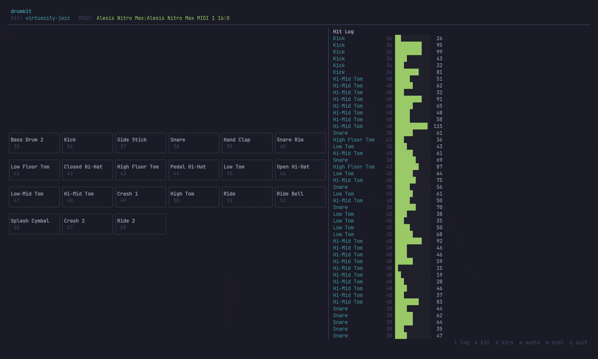

# drumkit

Low-latency TUI MIDI drum sampler for electronic drum kits on Linux and macOS.

Connect your e-drums (Alesis Nitro Max, Roland, Yamaha, etc.) via USB and trigger custom audio samples with sub-6ms latency. No DAW, no configuration files — just drop WAV files into a folder and play.



## Features

- **Sub-6ms latency** — lock-free audio pipeline with zero allocations on the audio thread, pre-decoded samples held in RAM, and a lock-free SPSC ring buffer between MIDI and audio threads
- **Simple sample mapping** — name WAV files by MIDI note number (`36.wav` for kick, `38.wav` for snare) and drop them into a folder
- **Velocity layers** — `38_v1.wav`, `38_v2.wav` for dynamic expression across the velocity range
- **Round-robin** — `38_v1_rr1.wav`, `38_v1_rr2.wav` to cycle through variations and avoid the machine-gun effect
- **Hot-reload** — edit samples while playing, changes load automatically with zero downtime
- **On-the-fly kit switching** — press `k` to browse and switch kits instantly, no restart needed
- **On-the-fly device switching** — press `a` to switch audio output devices and `m` to switch MIDI inputs without restarting
- **Note mappings** — built-in General MIDI and Alesis Nitro Max presets, per-kit `mapping.toml` support, user-created mappings, and live note renaming
- **Library directory management** — browse, add, and remove extra kit and mapping directories on-the-fly (`d`), persisted across restarts
- **Settings persistence** — selected kit, audio device, MIDI input, and extra directories are remembered between sessions
- **Hi-hat choke groups** — closing the hi-hat pedal chokes open hi-hat samples with a natural fade-out
- **Cymbal grab choke** — polyphonic aftertouch silences cymbals for realistic muting
- **Live pad visualization** — TUI grid shows hits with velocity-mapped green flash intensity
- **Hit log** — scrolling log of recent hits with note names, numbers, and velocity bars
- **Stderr capture** — ALSA/PipeWire noise captured and viewable in a log popup (`l`), keeping the TUI clean
- **Interactive setup** — guided picker for kit, audio device, and MIDI port if not specified via CLI flags
- **CLI-first** — all options available as flags for scripting and quick launch (`drumkit play --kit ./my-kit --port 0 --device 2`)

## Install

### From Homebrew (macOS)

```
brew tap backmeupplz/drumkit
brew install drumkit
```

### From PPA (Ubuntu/Debian)

```
sudo add-apt-repository ppa:borodutch/drumkit
sudo apt install drumkit
```

### From AUR (Arch Linux)

```
yay -S drumkit
```

### From source

```
git clone --recursive https://github.com/backmeupplz/drumkit.git
cd drumkit
cargo install --path .
```

### Build dependencies

- Rust 1.75+
- **Linux:** ALSA development libraries: `sudo pacman -S alsa-lib` (Arch) or `sudo apt install libasound2-dev` (Debian/Ubuntu)
- **macOS:** No additional dependencies — CoreAudio and CoreMIDI are provided by the system

### Sample kits

Sample kits (FreePats GM) live in a [separate repo](https://github.com/backmeupplz/drumkit-kits) to keep the main repo light — binary WAV files bloat git history. They're included as a git submodule at `./kits/`.

If you cloned without `--recursive`, pull the kits with:

```bash
git submodule update --init
```

drumkit will find them automatically in `./kits/` at startup.

## Quick Start

```bash
# 1. See what MIDI devices are connected
drumkit devices

# 2. Monitor MIDI input — hit pads to see note numbers
drumkit monitor --port 0

# 3. Play! Interactive setup picks kit, audio, and MIDI for you
drumkit play

# 4. Or skip setup entirely with flags
drumkit play --kit ~/.local/share/drumkit/kits/My-Kit --port 0 --device 2

# 5. Add extra sample library folders
drumkit play --kits-dir /path/to/samples --kits-dir /another/path
```

### Play Mode Keys

| Key | Action |
|-----|--------|
| `k` | **Kit picker** — browse and switch between discovered kits |
| `n` | **Mapping picker** — switch note name mappings (General MIDI, Alesis, user-created, or kit-bundled) |
| `r` | **Rename note** — rename the most recently hit pad (creates a user mapping if editing a built-in) |
| `d` | **Directory manager** — browse kit and mapping directories, add new ones (`a`/`A`), or remove user-added ones (`Del`) |
| `a` | **Audio device picker** — switch audio output device |
| `m` | **MIDI input picker** — switch MIDI input port |
| `l` | **Log viewer** — view captured stderr (ALSA/PipeWire noise) and kit summary |
| `q` | **Quit** |

All selections (kit, audio device, MIDI input) are saved to `~/.config/drumkit/settings.toml` and restored on next launch.

## Sample Library Structure

drumkit searches for kits in these directories:

- `./kits/`
- `$XDG_DATA_HOME/drumkit/kits/` (usually `~/.local/share/drumkit/kits/`)
- Any directories added via `--kits-dir` or the `d` directory manager

Each subdirectory containing audio files is a kit:

```
~/.local/share/drumkit/kits/
├── My-Rock-Kit/
│   ├── 36.wav              # Kick — single sample
│   ├── 38_v1_rr1.wav       # Snare — soft, variation 1
│   ├── 38_v1_rr2.wav       # Snare — soft, variation 2
│   ├── 38_v2_rr1.wav       # Snare — hard, variation 1
│   ├── 38_v2_rr2.wav       # Snare — hard, variation 2
│   ├── 42.wav              # Closed hi-hat
│   ├── 46.wav              # Open hi-hat
│   ├── 49.wav              # Crash
│   └── mapping.toml        # Optional kit-specific note names
└── Electronic-Kit/
    └── ...
```

Adding a new kit is instant — create a folder, drop in audio files, and press `k` to see it. Editing samples while playing triggers an automatic hot-reload with zero downtime.

Supported audio formats: WAV, FLAC, OGG, MP3.

### Naming Convention

`{midi_note}[_v{velocity_layer}][_rr{round_robin}].wav`

| Pattern | Meaning |
|---|---|
| `36.wav` | Single sample for MIDI note 36 (kick) |
| `38_rr1.wav`, `38_rr2.wav` | Round-robin only (cycles through variations) |
| `38_v1.wav`, `38_v2.wav` | Velocity layers only (v1=soft, v2=hard) |
| `38_v1_rr1.wav` | Both velocity layers and round-robin |

### Note Mappings

Mappings give human-readable names to MIDI note numbers and define choke groups. drumkit resolves mappings in this order:

1. **Kit-bundled** — if the kit folder contains a `mapping.toml`, it's loaded automatically when you switch to that kit
2. **User-selected** — press `n` to pick from available mappings (built-in presets, user-created, kit-bundled)
3. **Default** — General MIDI drum names

Built-in presets: General MIDI, Alesis Nitro Max.

**Creating a mapping:** press `r` after hitting a pad to rename it. If the current mapping is built-in, a user copy is created automatically. User mappings are saved to `$XDG_DATA_HOME/drumkit/mappings/` (usually `~/.local/share/drumkit/mappings/`).

**Kit-bundled mapping:** add a `mapping.toml` to your kit folder:

```toml
name = "My Kit"

[notes]
36 = "Kick"
38 = "Snare"
42 = "Closed Hi-Hat"
46 = "Open Hi-Hat"

[chokes]
42 = [46]    # closing hi-hat chokes the open hi-hat
44 = [46]    # pedal hi-hat also chokes open hi-hat
```

**Extra mapping directories:** press `d` then `A` to add directories containing `.toml` mapping files. These are persisted in settings and appear in the `n` picker.

### Common MIDI Note Numbers (General MIDI / Alesis Nitro Max)

| Note | Drum |
|---|---|
| 36 | Kick |
| 38 | Snare (head) |
| 40 | Snare (rim) |
| 42 | Closed Hi-Hat |
| 44 | Pedal Hi-Hat |
| 46 | Open Hi-Hat |
| 48 | Hi-Mid Tom |
| 45 | Low Tom |
| 43 | High Floor Tom |
| 41 | Low Floor Tom |
| 49 | Crash 1 |
| 57 | Crash 2 |
| 51 | Ride |

## Architecture

```
[MIDI Thread]  →  lock-free ring buffer  →  [Audio Thread (RT)]  →  speakers
                                                    ↑
[Filesystem Watcher]  →  [Main Thread / TUI]  →  sample reload
```

- MIDI input via `midir` (ALSA/JACK on Linux, CoreMIDI on macOS)
- Audio output via `cpal` (ALSA/PipeWire on Linux, CoreAudio on macOS)
- Lock-free SPSC ring buffer between threads (`rtrb`)
- Samples pre-decoded to f32 PCM in RAM
- Zero allocations on the audio thread
- `ArcSwap` for lock-free kit hot-swapping
- Filesystem watching via `notify` for automatic hot-reload

## Low-Latency Tips

For the best experience on Arch Linux with PipeWire:

```bash
mkdir -p ~/.config/pipewire/pipewire.conf.d
cat > ~/.config/pipewire/pipewire.conf.d/low-latency.conf << 'EOF'
context.properties = {
    default.clock.rate = 48000
    default.clock.quantum = 64
    default.clock.min-quantum = 32
}
EOF
systemctl --user restart pipewire
```

This brings PipeWire's buffer down to ~1.3ms. Combined with drumkit's lock-free pipeline, total pad-to-sound latency is typically under 6ms.

## Contributing

```bash
# Clone with sample kits
git clone --recursive https://github.com/backmeupplz/drumkit.git
cd drumkit

# Build in debug mode
cargo build

# Run directly
cargo run -- play

# Run tests
cargo test

# Build optimized release binary
cargo build --release
```

The codebase is a single Rust crate:

| Module | Purpose |
|--------|---------|
| `main.rs` | CLI parsing, resource wiring |
| `tui/` | Terminal UI, popups, key handling, rendering |
| `audio.rs` | Audio output stream, voice mixing |
| `midi.rs` | MIDI input, callback routing |
| `kit.rs` | Kit loading, velocity/round-robin grouping |
| `mapping.rs` | Note name mappings, choke groups, TOML parsing |
| `settings.rs` | Persisted user settings (kit, devices, directories) |
| `setup.rs` | Interactive setup flow |
| `sample.rs` | Multi-format audio decoding (WAV, FLAC, OGG, MP3) |
| `stderr.rs` | Stderr capture for clean TUI |

## License

MIT
